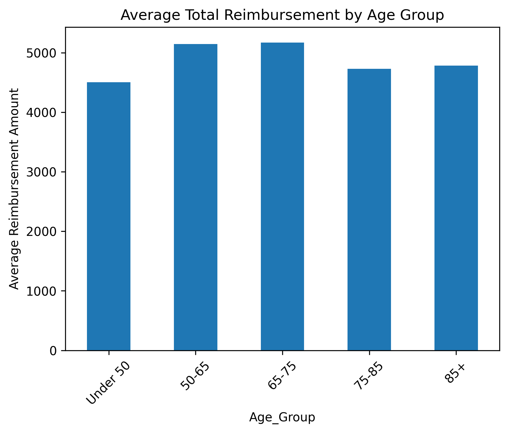
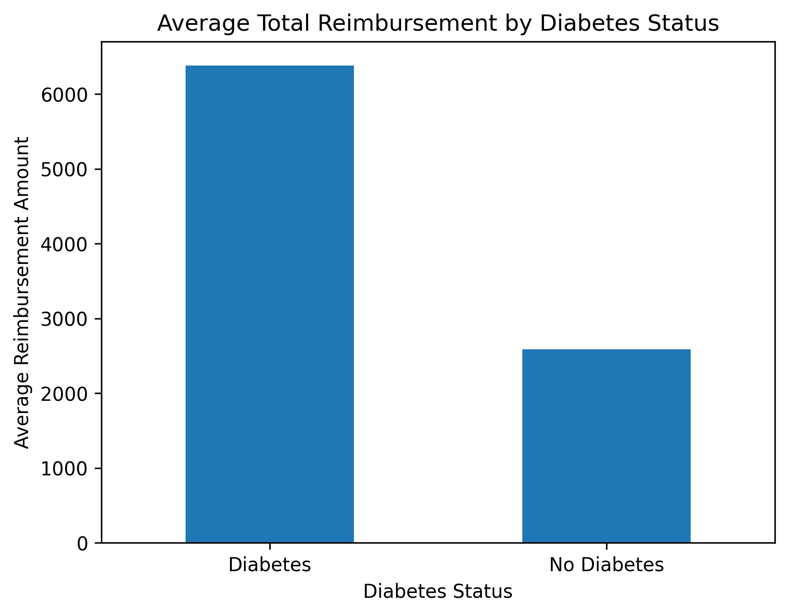

# Healthcare Data Analysis with Python

This project analyzes healthcare claims data to identify key cost drivers, demographic trends, and the impact of chronic conditions on healthcare spending.

## Tools Used
- Python (pandas, matplotlib)
- Jupyter Notebook

## Project Overview

This analysis explores how patient demographics and chronic conditions influence healthcare reimbursement patterns.

Key steps included:
- Data cleaning and preprocessing
- Feature engineering (age calculation from DOB)
- Outlier handling
- Creation of a total reimbursement metric (inpatient + outpatient)
- Aggregation and grouping for analysis
- Data visualization
- Insight generation

## Key Insights

### Age-Based Trends
- Reimbursement was lowest for beneficiaries under 50  
- Highest average costs were observed in the 50–75 age range  
- Costs did not increase consistently across all age groups, suggesting additional influencing factors beyond age  

### Chronic Condition Impact (Diabetes)
- Beneficiaries with diabetes had significantly higher average reimbursement compared to those without diabetes  
- Chronic conditions are a major driver of healthcare costs in this dataset

## Visualization Examples

### Age-Based Cost Analysis

### Diabetes Cost Analysis

## Project Structure

- `healthcare_analysis.ipynb` → Full analysis, code, and visualizations  
- Dataset used for analysis  

## How to Run

1. Open the notebook in Jupyter Notebook or JupyterLab  
2. Run all cells sequentially  
3. Review visualizations and insights  

## Key Skills Demonstrated

- Data cleaning and preprocessing  
- Feature engineering  
- Exploratory data analysis (EDA)  
- Data aggregation and grouping  
- Data visualization  
- Translating data into actionable insights  

---

## Author

KatCodes7
